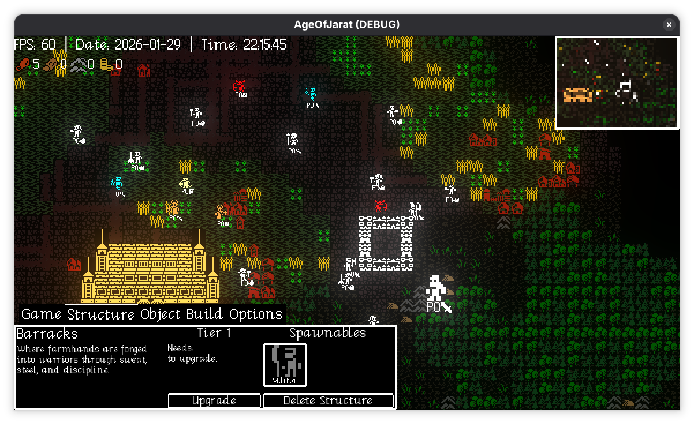
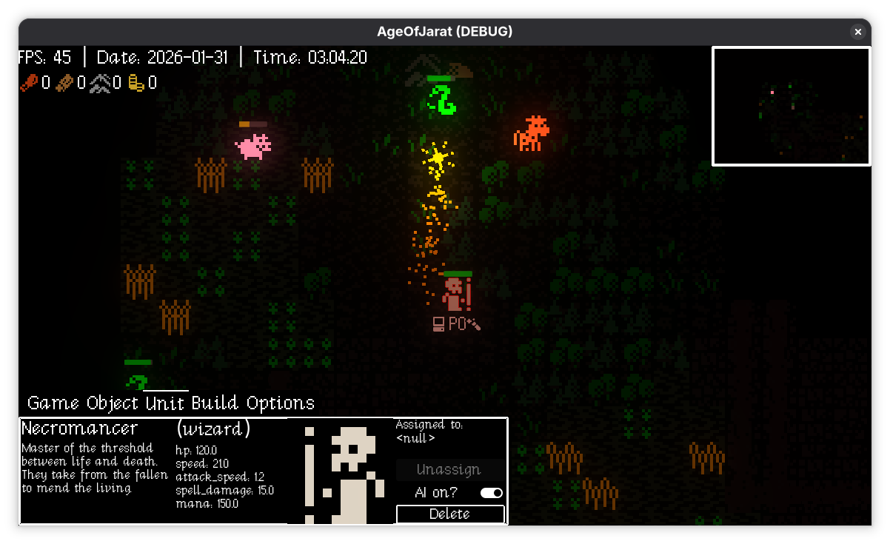
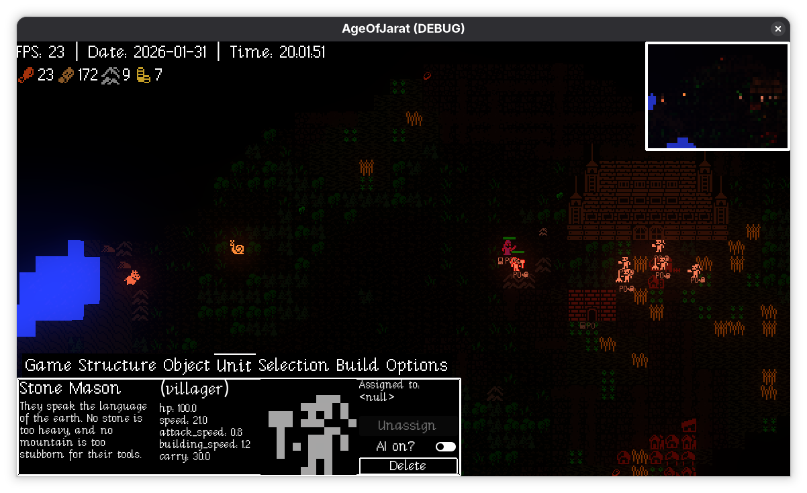

# ⚔️ Age of Jarat

> A high-performance, component-based 2D RTS engine for Godot 4.5. Featuring procedural landscapes, modular combat, and autonomous unit behaviors.

## 🧠 Unit AI & FSM
Units in *Age of Jarat* possess a sophisticated state-machine driven by the **WanderComponent**:
* **Autonomous States:** Units cycle through `IDLE`, `WANDER`, `AGGRO`, and `GATHERING`.
* **Stance System:** Toggle between `PASSIVE`, `DEFENSIVE`, and `AGGRESSIVE` behaviors.
* **Leash Logic:** Units stay within a defined radius of their "home," preventing aimless wandering.

## 🏹 Specialized Unit Classes
All units inherit from a base `Unit` class, implementing unique combat signatures:
* **Warrior:** Melee specialist utilizing the `MeleeAttackComponent` for physical strikes.
* **Archer & Wizard:** Ranged specialists using the `RangeAttackComponent` to launch arrows or spells (with optional **Poison** effects).
* **Villager:** The economic backbone, capable of building structures or harvesting "popped" tiles.

## 🗺️ Procedural Generation
The world is built dynamically using the `procedural.gd` engine:
* **Layered Environments:** Automatically generates seabed, water, sand, and grass.
* **Road Networks:** Uses a hub-and-spoke algorithm for realistic branching paths.
* **Harvesting:** Resources physically "pop" out of the map with a juice-filled animation before collection.

## 🖱️ RTS Interface & Controls
* **Selection Manager:** Features **Box Selection**, **Shift-Adding**, and **Control Groups (1-9)**.
* **Minimap System:** Real-time navigation via a secondary viewport camera.
* **Tabbed UI:** Efficiently cycle through build and unit menus using `Tab` and `Shift+Tab`.
* **Day/Night Cycle:** Networked lighting transitions synchronized across all peers.

## 🛠️ Project Architecture
The project follows a strict **Composition over Inheritance** model:
1.  **Entities:** (Villager, Warrior, Wizard) are containers for components.
2.  **Components:** (Health, Sound, Attack, Wander, Build) contain the specific logic.
3.  **Managers:** (Selection, Cursor, Music, UI) handle global game state.

## ⌨️ Controls
| Key | Action |
| :--- | :--- |
| **LMB Drag** | Group Selection |
| **RMB** | Move / Attack / Build / Interact |
| **Shift + LMB** | Add/Remove from Selection |
| **Ctrl + 1-9** | Assign Control Group |
| **Tab / Shift+Tab** | Cycle UI Menus |
| **~ (Tilde)** | Toggle Visual Post-Processing |

---
**Core Engine:** Godot 4.5 | **Developer:** nnj1 | **Architecture:** Component-Based RTS
